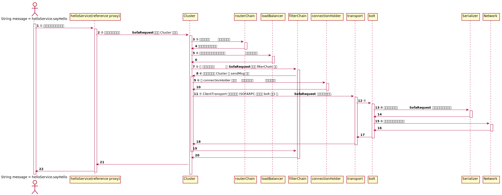
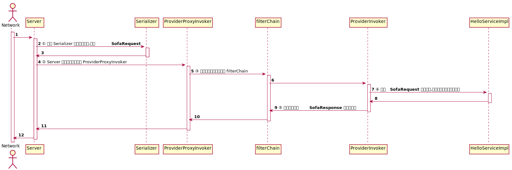

# 1. Big Picture

## 背景
本系列会详细介绍 SOFARPC 的实现实现细节. 本系列文章的目标是读者读完文章, 能快速上手 Debug SOFARPC , 也能快速上手参与 SOFARPC 开源共建.

如果你对什么是 RPC 还不了解,可以翻一下 0.Quick Start [TODO] 了解下. 我们将专注于一次服务调用,分别从**组件的功能和组织结构** \ **数据流转** \ **线程模型**三个方面简要介绍 SOFARPC 是如何处理一次请求调用的.


## 用户视角的一次请求调用
假设用户有如下一对接口和实现:

接口:
```java
public interface HelloService {
    String sayHello(String string);
}
```

实现:
```java
public class HelloServiceImpl implements HelloService {
    @Override
    public String sayHello(String string) {
        System.out.println("Server receive: " + string);
        return "hello " + string + " ！";
    }
}
```

在接入 SOFARPC 之后,客户端调用
```java
String message = helloService.sayHello("world");
```
服务端就会执行 `HelloServiceImpl` 的 sayHello 方法,并返回 `hello world!`. 客户端的 `message` 变量的值就是 `hello world!`了.


接下来, 我们会探究一下这个过程中, RPC 做了哪些事情.


## 组件视角
在一次调用过程中会涉及到多个 RPC 组件, 在他们的合作下,一次 RPC 调用才会被成功处理.

### 客户端组件
在客户端用户持有的 helloService 对象实质是一个引用代理(reference proxy),代理在 SOFARPC 中是一个比较重要的概念,如果你对这个概念有疑惑,可以移步下文 [代理模式 Proxy pattern](#proxy).

1. 用户将请求参数传递给代理(Proxy)
2. 在这个代理中,请求参数会被封装成 **SofaRequest** 对象传递到 Cluster 组件中.
3. 请求到达 Cluster 之后, 首先会通 routerChain 寻找到可用的**服务器地址信息**.
4. 然后由 loadBalancer 从可用**服务器地址信息**中根据负载均衡算法选出其中一台的**服务器地址信息**.
5. 选出目标服务器之后,将**服务器地址信息**和**SofaRequest**传递给 filterChain 处理, filterChain 中包含多个 Filter,他们能在**请求发出之前**以及**响应接收到后**做一些额外的处理.
6. FilterChain 中最后一个 Filter 是 ConsumerInvoker ,它负责将请求再传递回 Cluster 的 sendMsg 方法. sendMsg 方法会从 connectionHolder 中通过**服务器地址信息** 找到链接信息.链接信息由 ClientTransport 表示.
7. ClientTransport 使用网络框架 (SOFARPC 默认使用 bolt 框架) 将 **SofaRequest** 传输给目标服务器.
8. 在网络框架传输的过程中,会先使用序列化机制将 **SofaRequest** 序列化成二进制字节数组. SOFARPC 会适配不同的网络框架, 注册用户指定的序列化实现(Serializer).
9. 最终字节数组被发往目标服务器.
10. 服务端处理完成之后, 会返回一个 **SofaResponse** 对象, 这个对象会一路返回给最初那个代理,代理将 **SofaResponse** 中的真实返回值取出并返回, 最后 `message` 被赋值.

<!--
@startuml

autonumber

actor "String message = helloService.sayHello" as user
participant "helloService(reference proxy)" as proxy
participant "Cluster" as cluster
participant "routerChain" as router
participant "loadBalancer" as lb
participant "filterChain" as filter
participant "connectionHolder" as conn
participant "transport" as trans
participant "bolt" as bolt
participant "Serializer" as ser
participant "Network" as net


activate user
user -> proxy: ① 用户将请求参数传递给代理

activate proxy
proxy -> cluster: ② 请求参数会被封装成**SofaRequest**传递到 Cluster 组件中.

activate cluster
cluster -> router: ③ 寻找到可用的**服务器地址信息**
activate router
router -> cluster: 返回一堆服务器地址信息
deactivate router

cluster -> lb: ④ 根据负载均衡算法选出其中一台的**服务器地址信息**
activate lb
lb -> cluster
deactivate lb


cluster -> filter: ⑤ 将**服务器地址信息**和**SofaRequest**传递给 filterChain 处理
activate filter
filter -> cluster: ⑥ 将请求再传递回 Cluster 的 sendMsg 方法
activate cluster
cluster -> conn: ⑥ 从 connectionHolder 中通过**服务器地址信息** 找到链接信息
activate conn
conn -> cluster
deactivate conn

cluster -> trans: ⑦ ClientTransport 使用网络框架 (SOFARPC 默认使用 bolt 框架) 将 **SofaRequest** 传输给目标服务器.
activate trans

trans -> bolt: ⑦
activate bolt

bolt -> ser: ⑧ 使用序列化机制将 **SofaRequest** 序列化成二进制字节数组
activate ser
ser -> bolt
deactivate ser

bolt -> net: ⑨ 字节数组被发往目标服务器
activate net
net -> bolt
deactivate net

bolt -> trans
deactivate bolt


trans -> cluster
deactivate trans
cluster -> filter
deactivate cluster
filter -> cluster
deactivate filter

cluster -> proxy

proxy -> user
deactivate proxy


@enduml
 -->


#### 涉及的组件

* **Proxy:** 用于接口和标准 RPC 接口的转换. 它会创建一个实现用户接口的引用代理, 将用户对引用代理的调用转化为 RPC 内部 API 调用.
* **Cluster:** 用于组织一次 RPC 调用. 它包含了一次调用需要的一些组件,包括 RouterChain, LoadBalancer, FilterChain, ConnectionHolder 等.
* **Router:** 用于选取可用的服务器地址信息列表, 通常会和注册中心交互, 找到目标服务的可用地址.
* **LoadBalancer:** 用于从可用服务器地址信息列表中选取其中一个.
* **Filter:** 用于在请求前后做一些工作,比如统计信息,记录日志等.
* **ConnectionHolder:** 用于存储  **Trasnport** 实例, **Trasnport** 是 SOFARPC 用于具体保持链接, 发送请求的抽象组件.
* **Serializer:** 用于序列化和反序列化请求数据.


### 服务端组件

1. 服务端网络框架(Server)接收到客户端发来的字节数组之后,会通过 Serializer 进行反序列化,得到 **SofaRequest** .
2. Server 接着将请求传递给 ProviderProxyInvoker, ProviderProxyInvoker 是服务端 RPC 处理的入口, 它实现了 Invoker 接口的 invoke 方法, Server 会调用这个方法.
3. ProviderProxyInvoker 会将请求传递给服务端的 filterChain. 服务端最后一个 Filter 是 ProviderInvoker.
4. ProviderInvoker 通过 **SofaRequest** 中的信息,[反射](#reflection)调用具体的用户实现, 也就是 `HelloServiceImpl` 的 `sayHello` 方法.
5. 调用完成之后, ProviderInvoker 会将结果封装到 **SofaResponse** 对象中.
6. **SofaResponse** 会一路返回给 Server ,Server 将它序列话并传给客户端.





<!--
@startuml

autonumber

actor "Network" as net
participant "Server" as server
participant "Serializer" as ser
participant "ProviderProxyInvoker" as ppi
participant "filterChain" as filter
participant "ProviderInvoker" as pi
participant "HelloServiceImpl" as impl


activate net

net -> server
activate server

server -> ser: ① 通过 Serializer 进行反序列化,得到 **SofaRequest**
activate ser
ser -> server
deactivate ser

server -> ppi: ② Server 接着将请求传递给 ProviderProxyInvoker
activate ppi

ppi -> filter: ③ 将请求传递给服务端的 filterChain
activate filter

filter -> pi
activate pi

pi -> impl: ④ 通过 **SofaRequest** 中的信息,反射调用具体的用户实现
activate impl
impl -> pi
deactivate impl

pi -> filter : ⑤ 将结果封装到 **SofaResponse** 对象中返回
deactivate pi

filter -> ppi
deactivate filter

ppi -> server
deactivate ppi


server -> net
deactivate server

@enduml

 -->

#### 涉及的组件

- **Server:** Server 是一个服务器实现, 它会通过一个端口收发网络包, 并将网络包组合成 SOFARPC 能理解的对象.
- **Serializer:** 用于序列化和反序列化请求数据.
- **ProviderProxyInvoker:** 代表一个服务被注册到 Server 中, Server 收到请求之后, 会根服务唯一标识找到一个 **ProviderProxyInvoker**,将请求交给它处理.
- **Filter:** 用于在请求前后做一些工作,比如统计信息,记录日志等.


## 附录
<h3 id="proxy">代理模式 Proxy pattern</h3>
代理模式是一种设计模式, 为其他对象提供一种代理以控制对这个对象的访问。在某些情况下，一个对象不适合或者不能直接引用另一个对象，而代理对象可以在客户端和目标对象之间起到中介的作用。

在 SOFARPC 场景, 用户代码不适合直接访问 SOFARPC 的复杂 API, 因此 SOFARPC 提供了一个代理引用, 用户代码访问这个简单的代理引用,即可实现远程调用.

举个Java 动态代理的例子:
```java
public class HelloServiceImpl implements HelloService {
    public static void main(String[] args) {
        HelloService helloService = new HelloServiceImpl(); // 创建原始的 HelloServiceImpl 对象

        InvocationHandler h = new InvocationHandler() {
            @Override
            public Object invoke(Object proxy, Method method, Object[] args) throws Throwable {
                //代理类中修改请求参数
                if (args.length > 0 && args[0] instanceof String) {
                    args[0] = "**" + args[0] + "**";
                }
                return method.invoke(helloService,args);// 反射调用原始的 HelloServiceImpl 对象
            }
        };// 调用代理类时, 最终会调用到

        // 创建代理类
        HelloService proxy = (HelloService) Proxy.newProxyInstance(helloService.getClass().getClassLoader(), new Class[]{HelloService.class}, h);

        // 调用原始对象
        System.out.println(helloService.sayHello("world"));// 输出 hello world ！
        // 调用代理对象
        System.out.println(proxy.sayHello("world")); // 输出 hello **world** ！

    }

    @Override
    public String sayHello(String string) {
        return "hello " + string + " ！";
    }
}
```

在这个例子中,我们使用 Proxy 类创建了一个 HelloServiceImpl 的动态代理,为原始的 HelloServiceImpl 对象添加了一些行为. SOFARPC 中的处理也有类似的处理,会将方法调用转化为远程调用.


<h3 id="reflection">Java 中的反射</h3>
没有接触过 Java 的小伙伴可能不了解反射是什么, 这里给出一些资料 https://www.oracle.com/technical-resources/articles/java/javareflection.html
